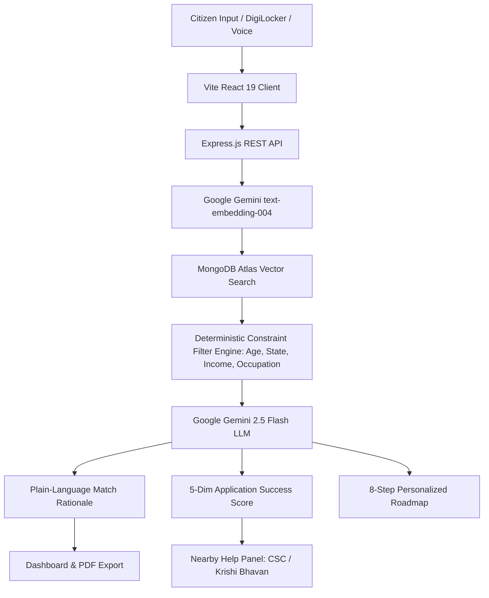

<div align="center">
  
  <h1>Setu AI (🏛️ सेतु AI)</h1>
  <p><strong>National AI-Powered Government Welfare Discovery & Household Intelligence Platform</strong></p>

  <p>
    <a href="https://setu-ai-six.vercel.app"></a>
  </p>

  <p>
    <a href="https://reactjs.org/"></a>
    <a href="https://www.typescriptlang.org/"></a>
    <a href="https://nodejs.org/"></a>
    <a href="https://www.mongodb.com/atlas"></a>
    <a href="https://deepmind.google/technologies/gemini/"></a>
    <a href="https://tailwindcss.com/"></a>
    <a href="LICENSE"></a>
  </p>

  <p>
    <a href="https://setu-ai-six.vercel.app"><strong>🌐 Try Live Production App: https://setu-ai-six.vercel.app</strong></a>
  </p>
</div>

---

## 🏆 Hackathon Project Summary

**Event**: Lenovo Leap Hackathon 2026  
**Track**: Civic-Tech & Artificial Intelligence  
**Creators**: Sparsh Gahoi & Yash Saxena  
**Status**: Production-Ready Civic Infrastructure Platform  

---

## 📌 Project Overview

Setu AI is an end-to-end **AI-powered civic-tech platform** designed to bridge the gap between 86+ complex government welfare schemes and millions of eligible Indian citizens. 

By combining a **4-stage Hybrid Retrieval-Augmented Generation (Hybrid RAG)** engine with deterministic constraint filters, multimodal document verification, household intelligence, and an 8-step application roadmap, Setu AI ensures citizens **never hallucinate eligibility** and can successfully claim every benefit they deserve.

---

## 📸 Screenshots & Key Features

| 🏠 Landing Page & Impact Counter | 👤 DigiLocker Auto-Profile Builder | 🎯 Scheme Matches & Benefit Gap Card |
| :---: | :---: | :---: |
| *(Landing hero, trust badges, live counters)* | *(DigiLocker OCR parsing & diff-merge)* | *(4-tier RAG matching, 5-dim success score)* |

| 🧪 Eligibility Simulator | 🗺️ 8-Step Application Roadmap | 👨‍👩‍👧 Family Household Intelligence |
| :---: | :---: | :---: |
| *(Hypothetical life-event simulation)* | *(Interactive journey with local CSC help panel)* | *(Multi-member matching & conflict detection)* |

| 💬 Grounded AI Copilot | 🏛️ Government Admin Portal | 📄 Official PDF Application Draft |
| :---: | :---: | :---: |
| *(Context-aware RAG chat with citations)* | *(6-tier RBAC, audit logs, scheme versioning)* | *(A4 client-side PDF export engine)* |

---

## 📖 The Problem

Over **₹2 lakh crore** in annual government welfare allocations go unclaimed in India due to three critical barriers:
1. **Information Fragmentation**: Eligibility criteria are scattered across 500+ state & central government portals.
2. **Jargon Barrier**: Scheme guidelines are written in complex legalistic terminology.
3. **Application Drop-off**: Citizens struggle with document preparation, missing deadlines, and navigating local government offices.

---

## 🟢 The Solution & Architecture

Setu AI solves this with a **guaranteed anti-hallucination pipeline**:


```mermaid
graph TD
    A[Citizen Input / DigiLocker / Voice] --> B[Vite React 19 Client]
    B --> C[Express.js REST API]
    C --> D[Google Gemini text-embedding-004]
    D --> E[MongoDB Atlas Vector Search]
    E --> F[Deterministic Constraint Filter Engine: Age, State, Income, Occupation]
    F --> G[Google Gemini 2.5 Flash LLM]
    G --> H[Plain-Language Match Rationale]
    G --> I[5-Dim Application Success Score]
    G --> J[8-Step Personalized Roadmap]
    H --> K[Dashboard & PDF Export]
    I --> L[Nearby Help Panel: CSC / Krishi Bhavan]
```

---

## ✨ Full Feature Suite (17 Capabilities)

| # | Feature | Description |
|---|---|---|
| 1 | **Hybrid RAG Matching** | Combines MongoDB `$vectorSearch` with strict constraint rules so AI never hallucinates. |
| 2 | **Explainable AI (Why Match)** | Plain-language bullet point rationale explaining qualification factors. |
| 3 | **DigiLocker Auto-Profile** | Auto-extracts Aadhaar/PAN details with AI diff-merge comparison. |
| 4 | **Benefit Gap Calculator** | Visual comparison of Potential vs Already Receiving vs Missing Benefits. |
| 5 | **AI Application Success Score** | 5-dimensional weighted score (Eligibility, Docs, Profile, Verification, Draft). |
| 6 | **Multimodal Doc Verification** | Gemini vision extracts document data, checks validity, name match, and quality. |
| 7 | **8-Step Application Roadmap** | Sequential step-by-step guidance with estimated completion time and portal links. |
| 8 | **Nearby Help Panel** | Location-aware assistance card showing nearest CSC, Krishi Kendra, and District Office. |
| 9 | **Household Scheme Intelligence** | Multi-member family profile matching with duplicate conflict detection. |
| 10 | **Eligibility Simulator** | Test hypothetical life event changes (income, state, age) to see scheme deltas. |
| 11 | **Grounded AI Copilot** | RAG-anchored conversational assistant with URL source citations and explainability logs. |
| 12 | **Scheme Change Tracker** | Version control on scheme updates with diff highlights and reminder notifications. |
| 13 | **Voice Everywhere** | Browser Web Speech API integration for hands-free voice input in Hindi/English. |
| 14 | **Government Admin Portal** | 6-tier RBAC (Moderator to Super Admin) with scheme CRUD and immutable audit logs. |
| 15 | **WhatsApp Assistant** | Twilio sandbox integration for instant notifications and deep-link access. |
| 16 | **Demo Mode** | One-click preset loader (Kamla Devi persona) for 5-minute judge presentations. |
| 17 | **DPDP Consent & Privacy** | Data minimization, explicit consent, right to hard deletion, and sandboxed prompts. |

---

## ⚡ Quick 5-Minute Judge Demo Instructions

1. Open [https://setu-ai-six.vercel.app](https://setu-ai-six.vercel.app)
2. Click **"Quick Demo Mode (Kamla Devi)"** on the Landing Hero.
3. You will immediately land on the **Matched Schemes** page with:
   - Preloaded profile for **Kamla Devi (Farmer, Uttar Pradesh, ₹1.2L income)**
   - **Benefit Gap Calculator** showing ₹72,000 potential aid
   - **4 Matched Schemes** with Success Scores and Urgency Badges
   - **Nearby Help Panel** displaying Common Service Centres in Varanasi
4. Click **"Ask AI"** on any scheme to test the **Grounded Copilot**.
5. Navigate to **Family** to see **Household Scheme Intelligence**.
6. Navigate to **Admin** to inspect the **Government Portal & Audit Logs**.

---

## 🛠️ Tech Stack

### Frontend
- **Framework**: React 19 + TypeScript 5
- **Build Tool**: Vite 8
- **Styling**: Tailwind CSS v4 + Custom Tokens
- **Animations**: Framer Motion + Canvas Confetti
- **Exports**: `html2canvas` & `jsPDF`

### Backend
- **Runtime**: Node.js 20 & Express.js + TypeScript
- **Database**: MongoDB Atlas Mongoose + `$vectorSearch` (768-dim embeddings)
- **AI Services**: Google Gemini SDK (`text-embedding-004` & `gemini-2.5-flash`)
- **Security**: JWT authorization, Bcrypt, CORS, Helmet, AbortController timeouts

---

## ⚙️ Local Setup Guide

### 1. Clone & Install
```bash
git clone https://github.com/yashsaxena27/setu-ai.git
cd setu-ai

# Install server
cd server && npm install

# Install client
cd ../client && npm install
```

### 2. Environment Variables

**client/.env**
```env
VITE_API_URL=http://localhost:5000
```

**server/.env**
```env
PORT=5001
MONGO_URI=your_mongodb_atlas_uri
JWT_SECRET=your_jwt_secret
CLIENT_URL=http://localhost:5173
GEMINI_API_KEY=your_google_gemini_api_key

# Twilio Channels (WhatsApp, SMS, Voice Call)
TWILIO_ACCOUNT_SID=your_twilio_sid_here
TWILIO_AUTH_TOKEN=your_twilio_auth_token_here
TWILIO_WHATSAPP_NUMBER=whatsapp:+14155238886

# SMTP Channels (Inbound & Outbound email)
SMTP_HOST=smtp.ethereal.email
SMTP_PORT=587
SMTP_USER=your_smtp_username_here
SMTP_PASS=your_smtp_password_here
EMAIL_FROM=welfare@setu-ai.org
```

### 3. Seed & Run
```bash
# Seed 86 schemes & vector embeddings
cd server
npm run seed
npm run embeddings
npm run dev

# Run client (in new terminal)
cd client
npm run dev
```
Open `http://localhost:5173` in your browser.

---

## 🔮 Future Roadmap & Production Scaling

1. 🏛️ **Live India Stack APIs**: Official API gateway integration with DigiLocker, Aadhaar eKYC, and UMANG.
2. 🎙️ **Vernacular Voice Agent**: Offline-capable local speech recognition in 12 regional Indian languages.
3. 📊 **Civic Analytics B2G Portal**: District Magistrate dashboard for tracking unmet welfare demand trends.
4. 📱 **SMS / USSD Gateway**: SMS fallback matching for feature phone users in deep rural pockets.

---

## 👨‍💻 Team & Credits

Built with ❤️ for **Lenovo Leap Hackathon 2026** by:
- **Sparsh Gahoi** — [LinkedIn](https://www.linkedin.com/in/sparsh-gahoi-05a212342/)
- **Yash Saxena** — [LinkedIn](https://www.linkedin.com/in/yash-saxena-21490a308/)

---

## 📄 License

Distributed under the MIT License. See `LICENSE` for details.
