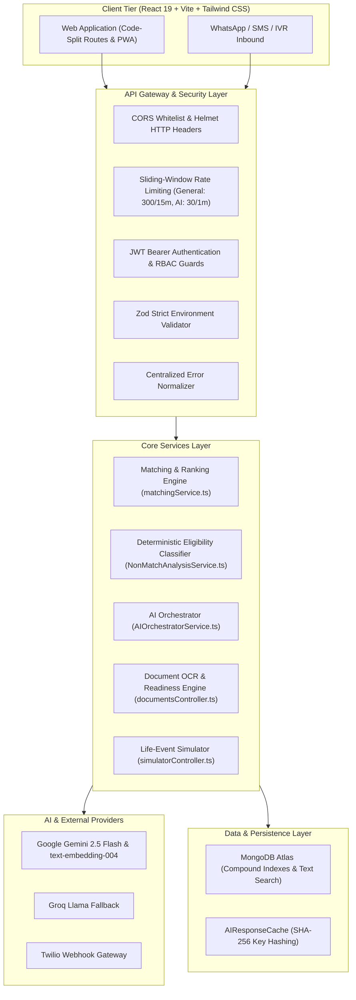

# SETU AI — SYSTEM ARCHITECTURE SPECIFICATION

## 1. System Overview
**Setu AI** is a production-grade, citizen-centric government welfare discovery, eligibility verification, and application intelligence platform.

The system combines:
1. **Deterministic Multi-State Eligibility Engine**: Hard mathematical evaluation of age, income, state domicile, category quotas, disability, and marital status.
2. **Dense Semantic Retrieval**: Google `text-embedding-004` (768-dim embeddings) coupled with MongoDB Atlas vector search.
3. **Explainable Hybrid Ranking**: Multi-signal scoring combining semantic similarity, regional relevance, category fit, data freshness, and eligibility state.
4. **Grounded AI Explainability**: Gemini 2.5 Flash with XML prompt fencing to eliminate hallucinations and prompt injection vulnerabilities.
5. **Multichannel Delivery**: Web PWA, WhatsApp/SMS, IVR Voice, and Inbound Email.

---

## 2. Architectural Blueprint

---

## 3. Core Architectural Invariants
1. **Deterministic Eligibility Over LLM Inference**: Hard constraints (age caps, income limits, state domicile) are computed deterministically in TypeScript. The LLM is **never** permitted to decide boolean eligibility.
2. **Grounded Generation & Injection Fencing**: Prompts are enclosed with strict XML delimiters (`<applicant_profile>`, `<verified_scheme_details>`) preventing user bio inputs from overriding instructions.
3. **Zero-Result Transparency**: If no schemes match, a structured `noResultDiagnosis` is returned explaining exact elimination factors and missing profile attributes.
4. **Resilient Fallbacks & Demo Mode**: AI requests utilize in-memory retries with exponential backoff, Groq fallbacks, and deterministic demo fixtures for high availability.
