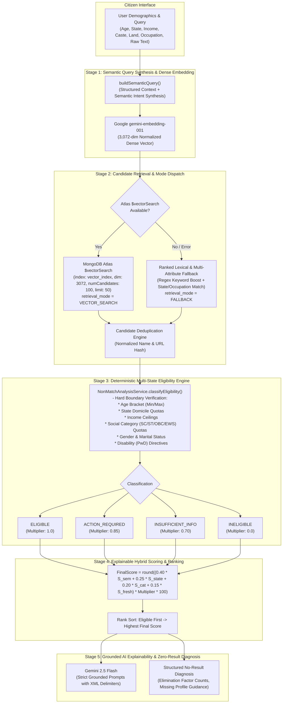

# SETU AI — RAG ARCHITECTURE SPECIFICATION & COGNITIVE RETRIEVAL ENGINE

## 1. System Pipeline Overview

---

## 2. Mathematical Hybrid Ranking Model

Setu AI employs an explainable hybrid ranking score bounded between $0$ and $99$:

$$\text{FinalScore} = \text{round}\left( \left( w_{\text{sem}} S_{\text{sem}} + w_{\text{state}} S_{\text{state}} + w_{\text{cat}} S_{\text{cat}} + w_{\text{fresh}} S_{\text{fresh}} \right) \times M_{\text{elig}} \times 100 \right)$$

### Weights & Signals:
* **$w_{\text{sem}} = 0.40$**: Semantic cosine similarity from vector query embedding (`$meta: "vectorSearchScore"`).
* **$w_{\text{state}} = 0.25$**: Regional relevance ($1.0$ for exact domicile match, $0.90$ for Pan-India, $0.50$ otherwise).
* **$w_{\text{cat}} = 0.20$**: Occupational / Category relevance ($1.0$ for direct match, $0.80$ for general).
* **$w_{\text{fresh}} = 0.15$**: Verification freshness ($1.0$ for verified/fresh, $0.70$ for stale).
* **$M_{\text{elig}}$ (Eligibility Multiplier)**:
  * **$\text{ELIGIBLE}$**: $1.0$
  * **$\text{ACTION\_REQUIRED}$**: $0.85$
  * **$\text{INSUFFICIENT\_INFORMATION}$**: $0.70$
  * **$\text{POTENTIAL\_MATCH}$**: $0.60$
  * **$\text{INELIGIBLE}$**: $0.00$

*Guarantee: An ineligible scheme receives $M_{\text{elig}} = 0.0$ and is filtered completely out of the recommended match pool.*

---

## 3. Five Granular Eligibility States

1. **`ELIGIBLE`**: All demographic criteria (Age, State, Income, Caste, Gender, Land, Disability, Marital Status) are satisfied.
2. **`ACTION_REQUIRED`**: Citizen qualifies in principle, but must complete a specific action item (e.g. upload caste certificate or self-declaration).
3. **`INSUFFICIENT_INFORMATION`**: Critical fields (such as state of domicile or income) were omitted by the citizen.
4. **`POTENTIAL_MATCH`**: Citizen partially aligns with discretionary scheme criteria.
5. **`INELIGIBLE`**: Citizen strictly violates one or more hard mathematical criteria.

---

## 4. Grounding & Anti-Hallucination Invariants
1. **Zero LLM Overrides**: The LLM is never invoked to decide boolean eligibility.
2. **Prompt XML Delimiters**: Inputs are enclosed in `<applicant_profile>` and `<verified_scheme_details>` tags to neutralize prompt injections.
3. **Negative Constraint Prompting**: If a detail is missing from official scheme records, the model outputs: *"Information not available in verified scheme data."*
